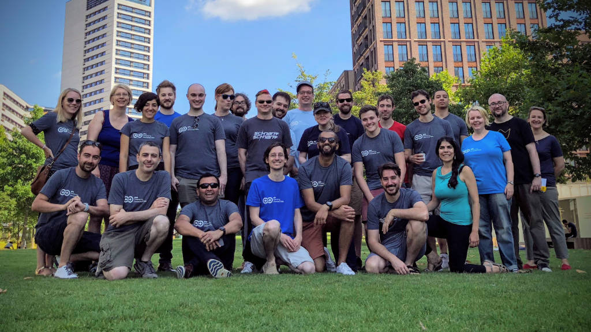

## about datalab

Youth audiences in particular are expecting the best content to be available to them in a single place, personalised to their preferences and interests. At the moment this is almost impossible for the BBC, since our content and audience data is distributed across myriad systems that are hard to connect. Additionally our content metadata is lacking, which makes it challenging to discover content. We are currently unable to properly engage the next generation of TV license fee payers, many of whom already have less affinity with the BBC than the rest of the UK population does.

The BBC Datalab was formed to address these issues, by creating a simpler way to discover content. We do this by bringing together everything we know about all BBC content in one place (the Content Graph) and using machine learning to enrich it (i.e. create additional metadata), so that we can identify content which is most relevant to individuals' interests and context. Our approach is to build a data “platform”, which can be extended by other BBC teams, and which allows many different products to create more consistent and relevant experiences for our audiences. 

In December 2018 we launched the first completely algorithmically driven (but editorially supervised) product in the BBC. While this is still very much an experimental platform with an audience experience that will still evolve, it provides an insight into the broader capability we are building. You can download it [here for iPhone](https://itunes.apple.com/gb/app/bbc/id1110317391) and [here for Android](https://play.google.com/store/apps/details?id=uk.co.bbc.bbc_plus&hl=en_US). 

For this quarter our team objectives are:  
1. Make it easy for BBC teams to rapidly develop and deploy Machine Learning engines  
2. Provide great recommendations across multiple products beyond BBC+

### learn more about our work

- [Beth has been writing about building on Google Cloud Platform](https://medium.com/@betandr/how-we-deliver-with-gcp-at-the-bbc-1c9812acf3a1)  

- [Theo has been talking about semantic web and linked data](https://www.youtube.com/watch?v=fz3YEX8NgtI)

- [Gabriel has been talking about how to use data science to help businesses](https://www.london.edu/faculty-and-research/lbsr/iie-podcast-how-data-science-can-boost-business) and [has also written on that topic.](https://www.london.edu/faculty-and-research/lbsr/making-big-data-deliver) He has also been speaking about [how to use a focus product in order to build ML capability in an organisation.](https://www.youtube.com/watch?v=dmlgc534SpE)

- [Tatiana has been talking about http vs gRPC](https://www.youtube.com/watch?v=-weU0Zy4Yd8)

- [Felix wrote about why we decided to open source](https://medium.com/bbc-design-engineering/data-science-and-machine-learning-course-3f00629212b7) our [internally developed 'Introduction to Data Science' training](https://github.com/bbc/datalab-ml-training)

- [Lana wrote about the challenges of and our approaches to building the BBC's first fully algorithmically driven but editorially supervised product](http://www.bbc.co.uk/blogs/internet/entries/a26a25af-4012-4f00-9fe9-2cc639a76340)

- [James wrote about building BBC+, an experimental approach to creating a BBC that is unique for each audience member](http://www.bbc.co.uk/blogs/internet/entries/82cd8d1e-2f23-4eff-8f34-0ef38ca8854c)

- We have been organising [24h Hackathons at the BBC focussed on machine learning and diversity](https://dms.licdn.com/playback/C4D00AQEfY8HwI7HhvQ/b90fdb31a4f942298cf5d258aa69d50f/feedshare-mp4_3300/1488578169071-zmy00q?e=1549731600&v=beta&t=P8HGRYCyP-X-Jw2rSPnpgJcyxb8LkdcFfJtO8v-FO8o)

- We have also been running the [Machine Learning Fireside Chats](https://www.meetup.com/Machine-learning-Fireside-Talks/) where we invite experts to discuss interesting questions on the strategic and ethical implications of ML

---

## our team values

**We are ambitious and tenacious**

We are excited by solving big problems and are tenacious in achieving our ambitious goals, but accept that this can take time and we may not succeed at the first attempt. 

**Diversity and opportunity**

Job descriptions and job titles are left at the door.  Everyone has equal right to contribute ideas and be heard.  We delight in sharing knowledge, expertise and learning - two heads are always better than one.

**We are empowered, responsible and accountable**

We always write our own narrative, and are proactive, not reactive, in our choices.  We don't blame others or find excuses, but take ownership of our own destiny.  We hold ourselves, and each other, to account, and highlight good and bad behaviour to help us all improve.

**We are strong; disagree and commit**

We don’t accept poor decisions simply for an easy life or to appease those more senior or more outspoken, and can disagree without fear of repercussions. We do commit 100% once a decision has been made. 

**Audiences are our ultimate focus**

If we don’t understand and can’t measure the benefit to audiences, we won’t do it.  We constantly test our priorities against what we learn about our audiences, and what they tell us they like and need. 

**We create value, not just code**

We advance the BBC’s knowledge and create a lasting legacy.  We deliver for the whole BBC, not just for our team. 

**We create space for new ideas**

We have the confidence to explore new ideas, and make time for audience-focused innovation and “play”.  

We think differently, which means people won’t always understand what we’re trying to do, so we make extra effort to clearly communicate our goals. 

**Progress, progress, progress**

We adopt only those processes that help us progress.  Pragmatism first: we change what doesn’t work, not accepting inefficiency and impedance.  

---

## join us

We are aiming high and have an open brief to define what works best for our audience. We want to stay lean and move quickly to build, test and learn as we go, so your contribution will make a difference from day one. We want everyone to feel responsible for our collective success.

You’ll have the opportunity to engage with engineers working on other BBC apps and services, tapping into the wealth of knowledge and experience of an organisation already serving a vast global audience. Learning is an important part of the role, and you’ll have access to BBC Academy training programmes, the opportunity to attend technology conferences, and use other resources to progress as an engineer.

We are looking for: 
- **lead data engineer:** the Datalab needs an inspiring engineering lead who has deep technical knowledge and experience (or a willingness) to take on the people management side of things. This role will be responsible for a talented team of up to ten engineers working on a stack that includes Google Cloud Platform, Python and Kubernetes with a commitment to micro-services and infrastructure as code. 
- **data scientist or senior data scientist:** we need someone to help us develop new recommendation engines that work with text, audio and video. You will also help us 'enrich' content by using machine learning to extract what the content is about. You know key machine learning algorithms well and are comfortable in putting these in use in production systems that serve millions of customers. Cloud (GCP), containers, CI/CD pipelines and Python are things that excite you.
- **data scientist, senior data scientist or lead data scientist (voice):** we need someone to help us bring machine learning to our voice (think alexa and google home) proposition. You have experience with extracting meaning from text, information retrieval, recommendation engines or conversational UIs and are excited to work embedded in a product team. These roles are ideally based out of Glasgow.
- **data engineer or senior data engineer:** you will help us create a data and machine learning environment that can scale to millions of users. You will help integrate new data sources and ensure that the code we write is robust and scalable. You have a keen interest in machine learning (but not necessarily previous experience). You are excited and knowledgeable about a tech stack that includes Google Cloud Platform, Python and Kubernetes with a commitment to micro-services and infrastructure as code. 

For more details email datalab @ bbc.co.uk
