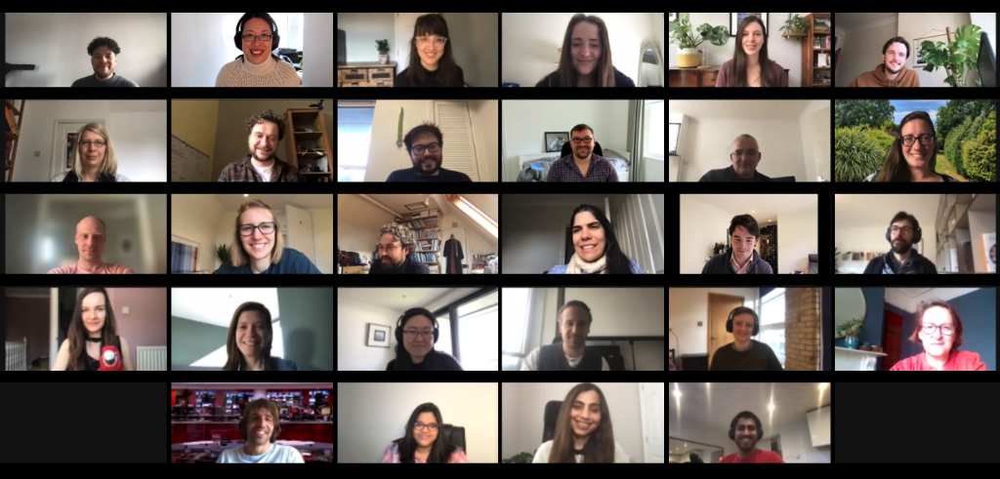

## Machine learning at the BBC
The developments in artificial intelligence (AI) and machine learning (ML) are amongst the great adventures of our time, and any organisation which expects to be a leader in the media industry must embrace these new technologies. The BBC rode the first waves of the broadcasting revolutions: with radio, television, and online. We mean to be [a part of the coming age of machine learning](https://www.bbc.co.uk/blogs/internet/entries/b2106d78-762c-403a-901a-2e34894c3ac1).

Audiences expect the best content to be available to them through seamless digital experiences, personalised to their preferences and interests. At the BBC, there is a vast quantity of content to offer our audiences - news, sport, weather, entertainment, programmes, audio, children’s, food, learning, and local. 

We want to harness our knowledge about our content, combine it with machine learning, and help our audiences easily find content they will love, whether that’s something new or a hidden gem from our impressive back catalogue.

---

## About BBC Datalab

Based all around the UK, we’re the team at the BBC that uses data and [responsible machine learning](https://www.bbc.co.uk/blogs/internet/entries/4a31d36d-fd0c-4401-b464-d249376aafd1) to help our audiences find relevant content. We want to ensure that audiences of all ages and backgrounds are able to easily engage with the entire BBC universe of rich and varied content, by excelling at combining our editorial expertise with machine learning. 

Practically, this means taking a collaborative approach. Our data scientists and engineers collaborate closely with editorial colleagues, user experience, product, as well as collaboration with other teams across the BBC.

We recently launched the first fully personalised in-house recommendation engine for [BBC Sounds](https://www.bbc.co.uk/sounds) and developed content-based recommendation engines for BBC News and World Service.

In 2021, our objectives are to:

1. Help BBC audiences find personally-relevant content by providing high-quality and reliable recommendations
2. Reduce the time, effort, and cost required to make the BBC relevant for each audience member
3. Make Datalab the most professionally challenging and rewarding place to work

---
## We're hiring!

- We're looking for a **Senior Software Engineer** to help us create a data and machine learning environment that can scale to millions of users. Find out more and apply [here](https://careershub.bbc.co.uk/members/modules/job/detail.php?record=53758).

---

### Learn more about our work

#### Machine learning at the BBC

- Gabriel described our approach to [scaling responsible Machine Learning at the BBC](https://www.bbc.co.uk/blogs/internet/entries/4a31d36d-fd0c-4401-b464-d249376aafd1)

- [Anna, Ewan and Svetlana share their experience about the collaboration between the editorial and data science colleagues within Datalab](https://www.bbc.co.uk/blogs/internet/entries/a38207dd-e4ed-40fa-8bdf-aebe1dc74c28)

- [Jana wrote about developing personalised recommender systems at the BBC](https://medium.com/bbc-design-engineering/developing-personalised-recommender-systems-at-the-bbc-e26c5e0c4216)

- [Jon has been talking about data science frameworks and managed services](https://www.youtube.com/watch?v=IZ8CBwP5nlA&list=PLGVZCDnMOq0ocea1dd0it7jX7HgvZCjSW&index=45&t=0s)

- [James wrote about building BBC+, an experimental approach to creating a BBC that is unique for each audience member](http://www.bbc.co.uk/blogs/internet/entries/82cd8d1e-2f23-4eff-8f34-0ef38ca8854c)

- [Lana wrote about the challenges of and our approaches to building the BBC's first fully algorithmically driven but editorially supervised product](http://www.bbc.co.uk/blogs/internet/entries/a26a25af-4012-4f00-9fe9-2cc639a76340)

- [Tatiana has been talking about http vs gRPC](https://www.youtube.com/watch?v=-weU0Zy4Yd8)

- [Gabriel was interviewed by DataFramed about data science at the BBC](https://www.datacamp.com/community/podcast/data-science-bbc)

- [Gabriel has been talking about how to use data science to help businesses](https://www.london.edu/faculty-and-research/lbsr/iie-podcast-how-data-science-can-boost-business) and [has also written on that topic.](https://www.london.edu/faculty-and-research/lbsr/making-big-data-deliver) He has also been speaking about [how to use a focus product in order to build ML capability in an organisation.](https://www.youtube.com/watch?v=dmlgc534SpE)

- [Theo has been talking about semantic web and linked data](https://www.youtube.com/watch?v=fz3YEX8NgtI)

- [Beth has been writing about building on Google Cloud Platform](https://medium.com/@betandr/how-we-deliver-with-gcp-at-the-bbc-1c9812acf3a1)

#### Careers, community, and learning

- Megan has been [co-hosting a new monthly data science podcast called "AI Right?"](https://open.spotify.com/show/4bRuzmU97MWPDTf2FxkEEc) 

- Richard has been writing [a series of articles on fundamental algorithms in machine learning](https://machinelearned.medium.com)

- Myrna was [interviewed by the RE•WORK podcast about her career path into responsible AI](https://www.youtube.com/watch?v=ztDwpCpHRp8)

- Christina was [featured on the Verified Geek podcast talking about how to get a job in data science](https://www.buzzsprout.com/1522516/7858450-christina-boididou-what-is-data-science-how-can-you-get-a-job-in-data-science)

- Jean created a microsite profiling [members of BBC Datalab and their machine learning careers](https://canvas-story.bbcrewind.co.uk/datalab-careers-ml/)

- Nicholas was [interviewed about doing his Data Science Apprenticeship in BBC Datalab](https://info.cambridgespark.com/latest/tech-skills-and-business-impact-with-apprenticeship-at-bbc)

- Sinead talked about [the BBC AI & ML Community supporting responsible machine learning](https://youtu.be/SnFpDS3-I3w)

- [Bettina](https://www.voicemag.uk/interview/6642/want-my-job-with-bettina-hermant-data-scientist) and [Aqsa](https://www.voicemag.uk/interview/6827/interview-with-aqsa-awan-technical-project-manager-for-bbc-datalab) were both interviewed by Voice Magazine to talk about their work in Datalab

- We previously organised [24h Hackathons at the BBC focussed on machine learning and diversity](https://www.dropbox.com/s/90wg5y14brcohev/HACKATHON_EXTERNAL.mov?dl=0)

- Felix wrote about [why we decided to open source](https://medium.com/bbc-design-engineering/data-science-and-machine-learning-course-3f00629212b7) our [internally developed 'Introduction to Data Science' training](https://github.com/bbc/datalab-ml-training)

- We previously ran [Machine Learning Fireside Chats](https://www.meetup.com/Machine-learning-Fireside-Talks/) where we invite experts to discuss interesting questions on the strategic and ethical implications of ML. [These discussions are also available as podcasts.](https://soundcloud.com/bbcmachinelearningpodcast)

---

## Our team values

**We are ambitious and tenacious**

We are excited by solving big problems and are tenacious in achieving our ambitious goals, but accept that this can take time and we may not succeed at the first attempt. 

**Diversity and opportunity**

Job descriptions and job titles are left at the door.  Everyone has equal right to contribute ideas and be heard.  We delight in sharing knowledge, expertise and learning - two heads are always better than one.

**We are empowered, responsible and accountable**

We always write our own narrative, and are proactive, not reactive, in our choices.  We don't blame others or find excuses, but take ownership of our own destiny.  We hold ourselves, and each other, to account, and highlight good and bad behaviour to help us all improve.

**We are strong; disagree and commit**

We don’t accept poor decisions simply for an easy life or to appease those more senior or more outspoken, and can disagree without fear of repercussions. We do commit 100% once a decision has been made. 

**Audiences are our ultimate focus**

If we don’t understand and can’t measure the benefit to audiences, we won’t do it.  We constantly test our priorities against what we learn about our audiences, and what they tell us they like and need. 

**We create value, not just code**

We advance the BBC’s knowledge and create a lasting legacy.  We deliver for the whole BBC, not just for our team. 

**We create space for new ideas**

We have the confidence to explore new ideas, and make time for audience-focused innovation and “play”.  

We think differently, which means people won’t always understand what we’re trying to do, so we make extra effort to clearly communicate our goals. 

**Progress, progress, progress**

We adopt only those processes that help us progress.  Pragmatism first: we change what doesn’t work, not accepting inefficiency and impedance.  

---

Want to find out more about our work? Please email datalab @ bbc.co.uk or follow us on [Twitter](https://twitter.com/bbcdatalab).
